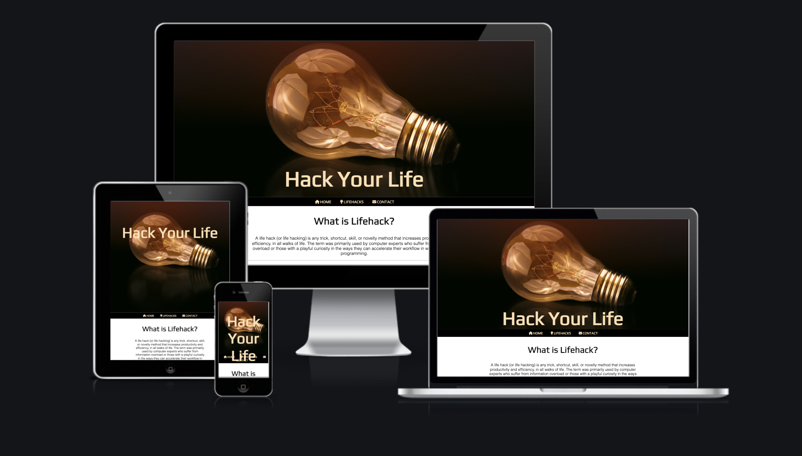
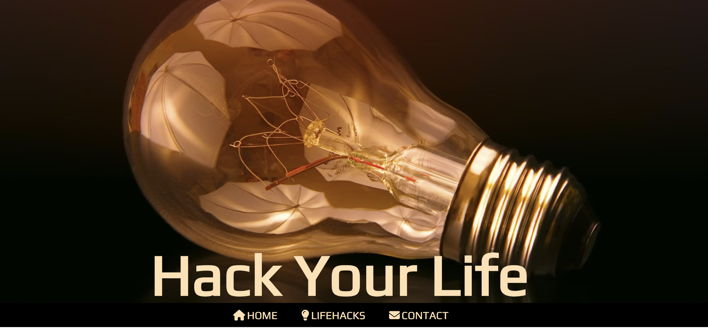

# [Hack Your Life](https://ilyailiev05.github.io/hack-your-life/) 



## Description

Hack Your Life is a website designed to help people involved in studying of any sort with providing
lifehacks to make studying more efficient and enjoyable. The audiance aimed at is every human being with the intention of learning some art, craft or simply anything.


## Challenges

Being my first ever project, it's needless to say that I found it very challenging in terms of selecting the right content,
building the right foundation on which to add the layout of my work in terms of color scheme, text structure and presentation and overall code quality. My aim was to eliminate errors in my code and offer a clean and easy to grasp website that is visually pleasing and of entertaining nature.


## Features

My header image I chose because the lightbulb symbolizes bright ideas or ideas in general. The light bulb on my website stands for life hacks and how they can simplify and brighen up a day in your life at a time. 



In my navigation bar you can find the home, life hacks and contact options. These are the main sections that add structure to my website. This makes it easier for the users to sail through and helping them easily find what they are looking for.

My second image represents the part in which the users who have made their way to hackyourlife.com are ready to take charge and implement positive changes to their daily life. 

The contact section is great for the user to be able to interact by sharing their own life hacks with me. That in turn would allow me to add more content in the future and expand my website so it can reach out and help more people. 


## Content


#### Code: 
https://www.w3schools.com/default.asp - This particular website helped me with adding my media query and making my website responsive for different screen sizes.

```css
/* Media Queries for small screen sizes from 950px wide and down */

@media screen and (max-width: 950px) {
    .vertical-center {
        top: 20%;
    }
}
```


#### Media:

Images for my header element and my lifehack section I borrowed from https://unsplash.com/.
My header image is thanks to @jplenio - https://unsplash.com/photos/fmTde1Fe23A
My lifehack section image is thanks to @juniorferreir - https://unsplash.com/photos/7esRPTt38nI


#### Icons & Fonts

The icons in the nav element were included from  [Font Awesome](https://fontawesome.com/)
The fonts and styling used in the website were icluded from [Google Fonts](https://fonts.google.com/)
Lifehack definition and history content were included from [Wikipedia](https://en.wikipedia.org/wiki/Life_hack)


#### Lifehacks

The lifehacks and content were included from [Lifehack](https://www.lifehack.org/417591/10-study-hacks-for-getting-better-grades)

# Testing

Tests Ran Through Lighthouse (ChromeDevTools)


## Validator

HTML

 >No errors were returned when passing through the official W3C validator

CSS

>No errors were found when passing through the official (Jigsaw) validator


### Thank You! Enjoy
